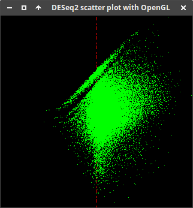

# Scatter plot with OpenGL

## Motivation

Rendering a scatterplot with alpha transparency in R/ggplot2 can take a very long time (minutes). I am interested in exploring OpenGL for visualizing two-dimensional data. In this example code, each data point is shown as a `GL_POINTS` type, which is rendered as one pixel. But it could also be a polygon with our without a texture. I would like to benchmark whether using the graphics card hardware to do alpha transparency and plotting speeds up drawing scatter plot variations. There seems to be very little previous work on this.

## Technique
This C++ program reads in a DESeq2 output file and displays baseMean against log2FoldChange.

The values in the TSV are floating point numbers. They are read in as `string` and need to be parsed to `double`, this is done using the boost library.
